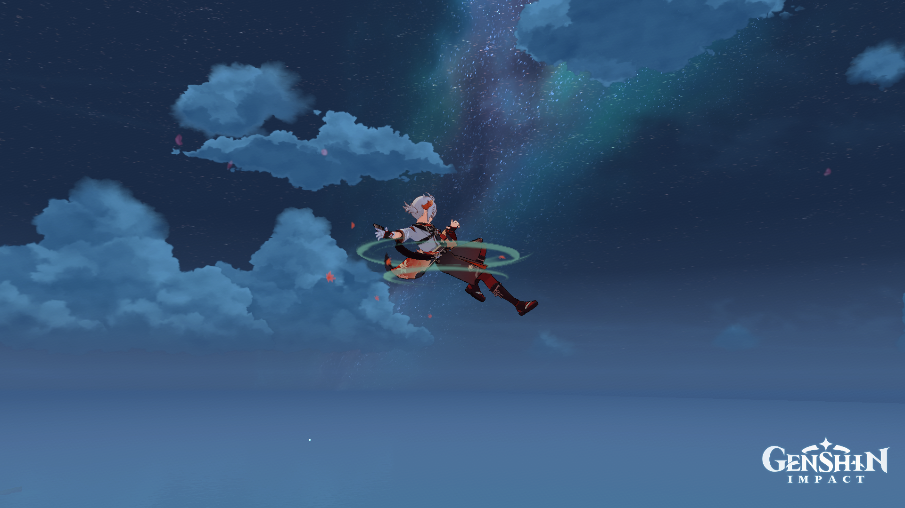
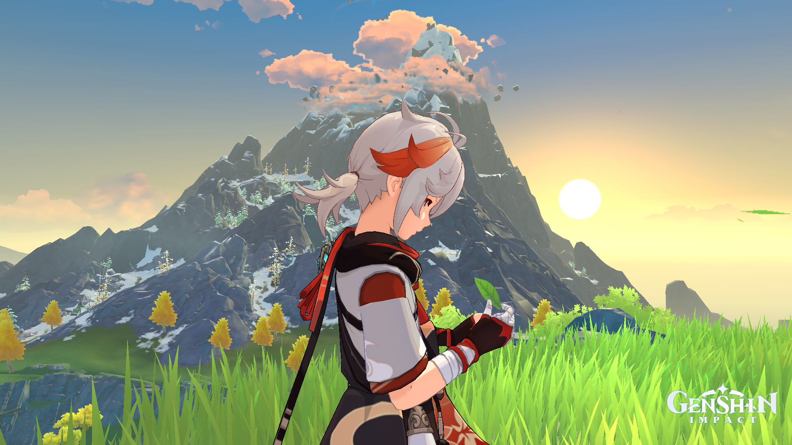
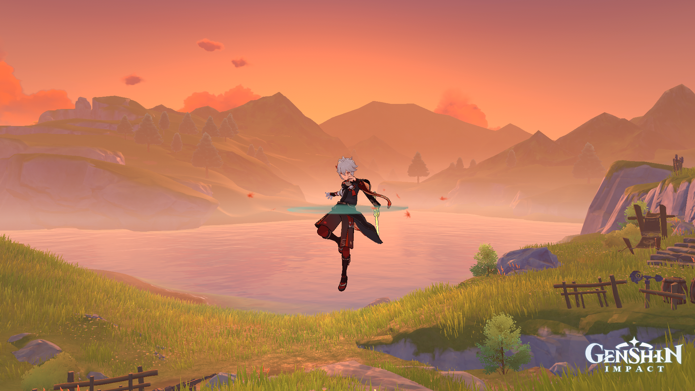

# PEC3: Visionando el futuro con las gafas de Manovich 

### Recurso de aprendizaje de Cultura Digital 

**Autor**: Gina Viñas Untoria

**Fecha**: 25/05/2023

 

## Planteamiento

La hibridación de medios es la convergencia de distintos tipos de medios que coexisten, y aparte forman un sistema que evoluciona a través de interacciones de medios más antiguas y más nuevas. 

Los medios híbridos en el contexto de los videojuegos son un buen ejemplo de ello, ya que fusionan diferentes tecnologías y elementos de diseño para crear experiencias interactivas únicas. Los videojuegos combinan elementos visuales, narrativos, de sonido y mecánicas de juego para ofrecer una forma de medio híbrido que permite a los jugadores sumergirse en mundos virtuales y participar activamente en la historia y la jugabilidad.

Por ello en este ensayo presentaré dos videojuegos que pertenecen a estos casos de hibridación del software, ***Genshin Impact*** y ***League of Legends***.

## Hibridación, multimedia y remediación

Una hibridación se reconoce porque introduce nuevas formas de representar el mundo, introduciendo innovaciones y proporcionando diferentes formas de interacción y navegación.

La multimedia combina diferentes tipos de medio en un mismo contexto, pero sin generar una fusión o interacción entre ellos, por ejemplo cada uno necesita abrir su propio recurso. En cambio, en la hibridación se da una fusión entre los elementos e interfaces, generando una experiencia nueva, diferente a la experimentación de los elementos por separado.

Por otro lado, la remediación implica la adaptación de un medio existente para construir un nuevo medio, conservando algunas características pero también introduciendo cambios y novedades.

## Re-descubriendo la hibridacion: Genshin Impact

***Genshin Impact*** es un **videojuego de rol, aventura, y exploración en mundo abierto** desarrollado por **Mihoyo** para consolas, móviles y PC. Ofrece diferentes maneras de navegar e interactuar con el medio. Como viajero de otro mundo, te embarcas en una aventura para encontrar a la hermana que perdiste hace mucho tiempo, mientras descubres los misterios de ***Teyvat***, del personaje principal y los que conforman la historia. 

Los personajes principales de esta historia tienen habilidades, personalidades y estilos de combate únicos, y los puedes conseguir junto a armas para ellos mediante la mecánica de monetización del ***gacha***, una moneda virtual. El juego también cuenta con un modo multijugador donde poder luchar contra monstruos, hacer misiones y explorar el mundo juntos a otros jugadores.

 

Según Manovich, ***Genshin Impact*** se considera un caso de hibridación de medios más que de multimedia y una hibridación tanto de interfaz de usuario como de manipulación de datos. Aunque el juego ofrece varios tipos de medios, como gráficos, sonido y texto, la hibridación de este se produce a través de la fusión de elementos de juegos de rol, **anime** y ***gacha*** en la interfaz de usuario para una experiencia de navegación e interacción nueva e integrada. 

El juego utiliza algoritmos y estructuras de datos para generar y controlar distintos aspectos del mundo del juego, como la generación de misiones, terrenos, enemigos, sistemas de combate y eventos. Estos permiten simplificar y controlar modelos complejos dentro del juego. 

 

La estética en ***Genshin Impact*** se caracteriza por ser híbrida, combina elementos de diseño de personajes y escenarios de estilo anime con gráficos en 3D, logrando una estética visual única que fusiona diferentes influencias estilísticas. 

## Re-descubriendo la hibridacion: League of Legends

***League of Legends*** es un **videojuego multijugador de arena de batalla en línea** desarrollado y publicado por **Riot Games**. Combina elementos de juegos de estrategia en tiempo real, los juegos de rol en línea y los eSports o deportes electrónicos.

En las partidas normales y de competición, cada equipo está compuesto por cinco jugadores especializados en una línea entre las siguientes: **Top, Jungla, Mid, ADC y Support**. Los equipos se enfrentan en partidas estratégicas en un mapa virtual llamado "La grieta del invocador". El objetivo principal es destruir el **nexo** del equipo contrario, mientras se defiende el propio. Los jugadores compiten con un campeón que está asociado a una clase o rol que determina su estilo de juego en las partidas, utilizando estrategias y tácticas para superar a sus oponentes. 

 

Las partidas clasificatorias (rankeds) en ***League of Legends*** son un modo de juego competitivo en el que los jugadores pueden enfrentarse entre sí para subir en el sistema de clasificación. Consta de distintas divisiones (como Hierro, Bronce, Plata, Oro, Platino, Diamante, Maestro, Gran Maestro y Challenger), cada una con diferentes rangos. Los jugadores están más enfocados en ganar y mejorar su clasificación. Esto implica un mayor nivel de estrategia, comunicación y coordinación con el equipo para tener éxito, ofreciendo la oportunidad de alcanzar rangos más altos y recibir recompensas al final de la temporada. 

El juego utiliza algoritmos y estructuras de datos para gestionar la jugabilidad. Desde cómo se desplazan los personajes hasta cómo interactúan con el entorno y otros jugadores. También se encargan de equilibrar los personajes y sus habilidades, asegurándose de que ningún campeón sea demasiado poderoso o demasiado débil en comparación con los demás, esto implica el cálculo de daño, tiempos de reutilización, alcance, efectos especiales y más. También se controlan eventos que ocurren dentro del juego, como la aparición de monstruos neutrales en la jungla, la generación de oleadas de súbditos en las líneas, la activación de habilidades especiales, entre otras.

 

La estética en ***League of Legends*** se caracteriza por combinar elementos visuales de fantasía, mitología, ciencia ficción y arte de cómic para crear una estética visual única que refleja el mundo y los personajes del juego. 

***League of Legends*** es uno de los juego más populares en el ámbito de los **esports**, donde equipos profesionales compiten en partidas estratégicas para ganar torneos y campeonatos regionales e internacionales. El juego ha creado una comunidad global de jugadores reconocidos y admirados por una comunidad de espectadores apasionados, y su escena competitiva sigue creciendo y evolucionando.

## Conclusion

***Genshin Impact*** y ***League of Legends*** son ejemplos destacados de hibridación de medios en los videojuegos y los deportes electrónicos. Ambos combinan diferentes técnicas de interfaz de usuario, manipulación de datos y estéticas visuales para ofrecer experiencias de juego únicas, divertidas y atractivas.

### Referencias y Bibliografía

* Manovich, Lev. (2013). **El Software toma el mando**. Barcelona: Editorial UOC. 

----

Licencia: Material Creative Commons desarrollado bajo licencia CC BY-SA 4.0. Imágenes CC BY [Tubik studio](https://blog.tubikstudio.com/how-to-create-original-flat-illustrations-designers-tips/) 
